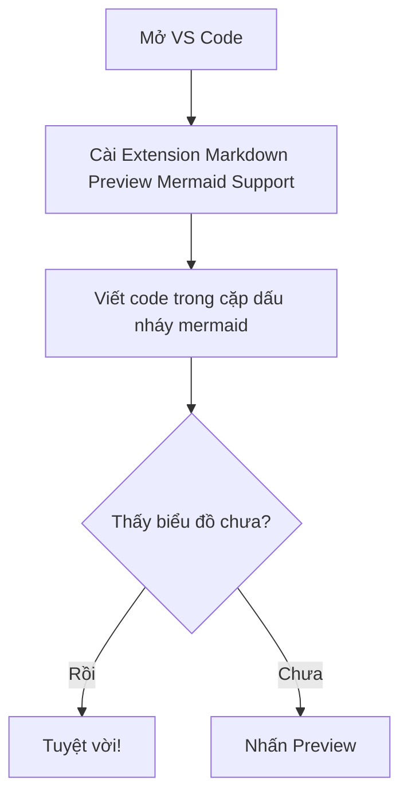

Giới thiệu về Mermaid: https://viblo.asia/p/mermaid-ve-diagram-va-chart-de-nhu-an-keo-bang-markdown-zXRJ8mEZLGq

Cách để sử dung Mermaid trong Markdown trên VS Code: Cài Markdown Preview Mermaid Support

Demo về Mermaid:

File Mermaid có đuôi là .mmd.
Sử dụng Extension Mermaid Editor hoặc Mermaid để có thể preview trực tiếp file .mmd, hơn nữa còn có thể export ra thành file .svg, .png, ...

Ngoài ra, còn có thể edit file mermaid online tại: https://mermaid.live/edit

Open Source: https://github.com/mermaid-js/mermaid

